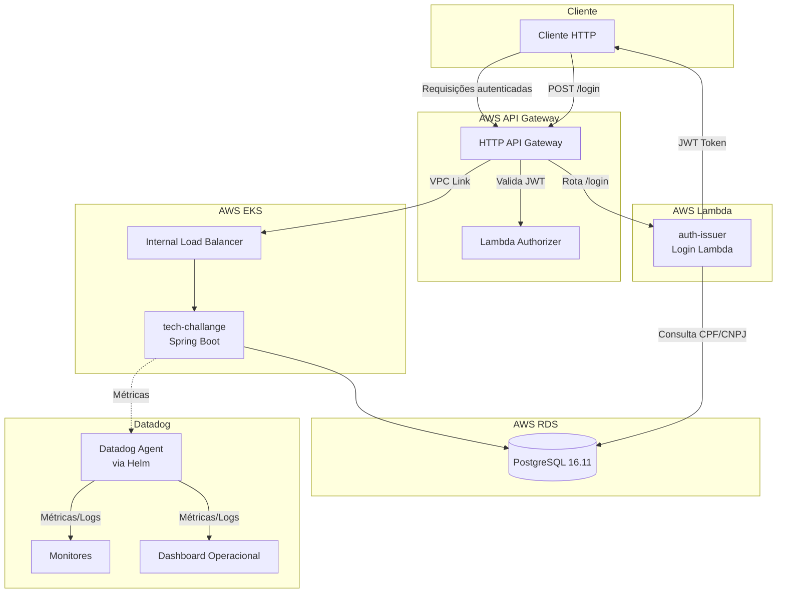
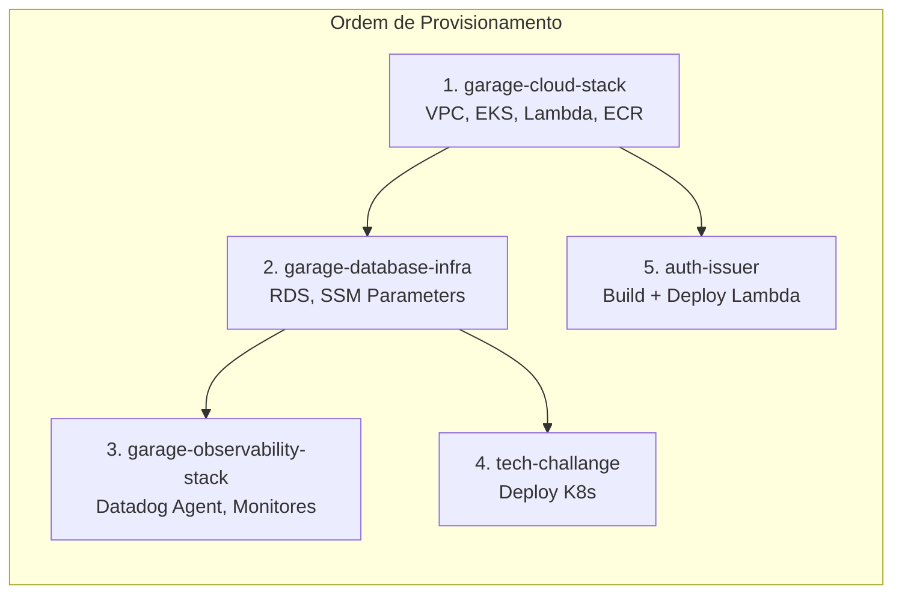
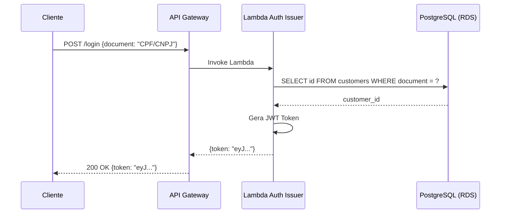
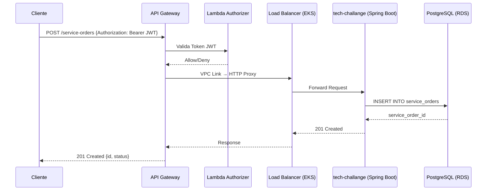

# Documento de Design — Finalização do Projeto de Pós-Graduação

## Visão Geral

Este documento descreve o design técnico para a finalização do projeto "Garage", cobrindo os 13 requisitos pendentes distribuídos em cinco repositórios. O escopo inclui: configuração de build e CI/CD para o `auth-issuer`, atualização de infraestrutura no `garage-cloud-stack`, pipelines CI/CD para repositórios Terraform, documentação de APIs, validação da stack de observabilidade, configuração de segurança dos repositórios GitHub e criação de artefatos de documentação arquitetural (RFCs, diagramas de sequência e componentes).

### Estado Atual do Projeto

| Repositório | Estado | Pendências Principais |
|---|---|---|
| `auth-issuer` | Código Go funcional, sem `go.mod`, `go.sum`, `Dockerfile`, sem pipeline CI/CD, sem docs de API | Requisitos 1, 2, 3 |
| `garage-cloud-stack` | Terraform completo, pipeline CI/CD existente, `eks_lb_listener_arn` vazio | Requisito 4 |
| `garage-database-infra` | Terraform completo, sem pipeline CI/CD, diretório `docs/` vazio | Requisitos 5, 6 |
| `garage-observability-stack` | Terraform completo com monitores e dashboard Datadog, sem pipeline CI/CD | Requisitos 7, 8 |
| `tech-challange` | Aplicação Spring Boot com pipeline CI/CD existente, sem Swagger/OpenAPI configurado | Requisito 9 |
| Todos | Sem branch protection configurada, sem colaborador `soat-architecture` | Requisitos 10, 11 |
| Projeto | ADRs existentes no `tech-challange/docs/adr/`, sem RFCs de cloud/DB/auth, sem diagramas de sequência | Requisitos 12, 13 |

## Arquitetura

O projeto Garage segue uma arquitetura de microserviços na AWS com os seguintes componentes:



### Fluxo de Deploy



## Componentes e Interfaces

### Componente 1: Build do auth-issuer (Requisito 1)

O repositório `auth-issuer` contém uma aplicação Go que funciona como AWS Lambda. Atualmente possui o código-fonte mas falta a configuração de módulo Go e containerização.

**Artefatos a criar:**

- `go.mod` — Módulo `com.fiapchallenge/tech-challange-auth-issuer`, Go 1.25, dependências: `github.com/aws/aws-lambda-go`, `github.com/lib/pq`, `github.com/golang-jwt/jwt/v5`
- `go.sum` — Gerado automaticamente via `go mod tidy`
- `Dockerfile` — Multi-stage build: compilação com `golang:1.25-alpine`, execução com imagem mínima compatível com Lambda (usando `public.ecr.aws/lambda/go` ou `provided.al2023`)

**Dockerfile proposto:**
```dockerfile
FROM golang:1.25-alpine AS builder
WORKDIR /app
COPY go.mod go.sum ./
RUN go mod download
COPY . .
RUN CGO_ENABLED=0 GOOS=linux go build -o bootstrap main.go

FROM public.ecr.aws/lambda/provided:al2023
COPY --from=builder /app/bootstrap ${LAMBDA_RUNTIME_DIR}/bootstrap
CMD ["bootstrap"]
```

### Componente 2: Pipeline CI/CD do auth-issuer (Requisito 2)

Pipeline GitHub Actions em `.github/workflows/pipeline.yml` com os seguintes jobs:

1. **build** — Checkout, setup Go, `go mod download`, `go build`, `go test`
2. **docker** — Build da imagem Docker, push para ECR (`garage-auth-issuer`)
3. **deploy** — Atualização da Lambda via `aws lambda update-function-code`

**Trigger:** Push na branch principal (`main` ou `master`)
**Secrets necessários:** `AWS_ACCESS_KEY_ID`, `AWS_SECRET_ACCESS_KEY`, `AWS_SESSION_TOKEN`

### Componente 3: Documentação de API do auth-issuer (Requisito 3)

Adição ao `README.md` de uma seção de documentação da API com:

- Endpoint: `POST /login`
- Request body: `{ "document": "<CPF ou CNPJ>" }`
- Respostas: `200 OK` com `{ "token": "<JWT>" }`, `400` para documento inválido/vazio, `404` para usuário não encontrado
- Opcionalmente, uma coleção Postman exportada em `docs/postman_collection.json`

### Componente 4: Atualização do LB Listener ARN (Requisito 4)

Atualização do arquivo `garage-cloud-stack/infra/terraform.tfvars`:
- Obter o ARN real do listener do Load Balancer interno do EKS via `aws elbv2 describe-listeners`
- Preencher a variável `eks_lb_listener_arn` com o valor obtido
- Isso ativará os recursos condicionais (`count = var.eks_lb_listener_arn != "" ? 1 : 0`) no `api_gateway.tf`: VPC Link, integração HTTP_PROXY e rota protegida

### Componente 5: Pipeline CI/CD do garage-database-infra (Requisito 5)

Pipeline GitHub Actions em `.github/workflows/pipeline.yml` seguindo o padrão do `garage-cloud-stack`:

- **Em Pull Request:** `terraform init` + `terraform plan` com resultado no status check
- **Em merge na branch principal:** `terraform init` + `terraform apply -auto-approve`
- Configuração de concurrency para evitar applies simultâneos
- Backend S3 já configurado no `main.tf`

### Componente 6: Documentação do garage-database-infra (Requisito 6)

Criação de documentos no diretório `docs/`:

1. `docs/database-justification.md` — Justificativa da escolha do PostgreSQL: critérios (compatibilidade com RDS, suporte a ACID, maturidade, custo), alternativas (MySQL, DynamoDB), decisão final
2. `docs/er-diagram.md` — Diagrama ER em Mermaid com as entidades: Customer, Vehicle, ServiceOrder, Part, Budget, User
3. `docs/entity-relationships.md` — Descrição textual dos relacionamentos entre entidades

### Componente 7: Pipeline CI/CD do garage-observability-stack (Requisito 7)

Pipeline idêntica ao padrão do Componente 5, adaptada para o repositório de observabilidade:

- Secrets adicionais: `DATADOG_API_KEY`, `DATADOG_APP_KEY`
- Variáveis de ambiente para os providers Datadog, Helm e Kubernetes
- Necessita de acesso ao cluster EKS para o provider Kubernetes/Helm

### Componente 8: Validação da Stack de Observabilidade (Requisito 8)

**Estado atual dos monitores (já implementados em `datadog_monitors.tf`):**

| Monitor | Tipo | Warning | Critical | Status |
|---|---|---|---|---|
| API Latency P95 | metric alert | 1000ms | 2000ms | ✅ Implementado |
| CPU Usage | metric alert | 80% | 95% | ✅ Implementado |
| Memory Usage | metric alert | 80% | 95% | ✅ Implementado |
| Health Check | service check | — | 2 falhas | ✅ Implementado |
| Service Order Error Rate | metric alert | 5% | 15% | ✅ Implementado |

**Estado atual do dashboard (já implementado em `datadog_dashboard.tf`):**

| Widget | Status |
|---|---|
| Volume Diário de OS Criadas | ✅ Implementado |
| Tempo Médio por Fase (diagnóstico, execução, finalização) | ✅ Implementado |
| Contagem de Erros por Operação | ✅ Implementado |
| Latência P50/P90/P99 das APIs REST | ✅ Implementado |
| Consumo CPU/Memória dos Pods | ✅ Implementado |
| Uptime Percentual (24h e 7d) | ✅ Implementado |

**Pendência:** Validar configuração de logs JSON com correlation ID. O Datadog Agent está configurado com `logs.enabled: true` no Helm chart, mas a configuração de formato JSON e correlation ID depende da aplicação Spring Boot (logback/log4j2) emitir logs nesse formato.

### Componente 9: Documentação de API do tech-challange (Requisito 9)

A aplicação Spring Boot não possui `springdoc-openapi` no `pom.xml`. Opções:

1. **Opção A (recomendada):** Adicionar dependência `springdoc-openapi-starter-webmvc-ui` ao `pom.xml`, configurar `OpenApiConfig.java`, e adicionar link para `/swagger-ui.html` no README
2. **Opção B:** Criar coleção Postman manualmente e exportar como JSON em `docs/`

### Componente 10: Branch Protection (Requisito 10)

Configuração via GitHub Settings ou API para os 5 repositórios:

- Branch: `main` (ou `master` conforme o repositório)
- Require pull request reviews: mínimo 1 aprovação
- Require status checks to pass before merging (quando aplicável)

**Nota:** `garage-cloud-stack` e `tech-challange` usam branches diferentes (`master` vs `main`). Verificar a branch padrão de cada repositório.

### Componente 11: Acesso do Colaborador (Requisito 11)

Adição do usuário `soat-architecture` como colaborador em todos os 5 repositórios via GitHub Settings > Collaborators, com permissão de leitura (`Read`) ou superior.

### Componente 12: RFCs (Requisito 12)

Criação de 3 documentos RFC no diretório `tech-challange/docs/adr/` (onde já existem ADRs):

1. `0004-escolha-plataforma-cloud-aws.md` — Critérios: ecossistema acadêmico FIAP, serviços gerenciados (EKS, RDS, Lambda), custo com AWS Academy
2. `0005-escolha-banco-dados-postgresql.md` — Critérios: compatibilidade RDS, ACID, maturidade, suporte a JSON
3. `0006-estrategia-autenticacao-lambda-jwt.md` — Fluxo: API Gateway → Lambda Authorizer → JWT validation, justificativa serverless

### Componente 13: Diagramas Arquiteturais (Requisito 13)

Criação de diagramas em Mermaid no diretório `tech-challange/docs/`:

1. **Diagrama de Sequência — Autenticação:**


2. **Diagrama de Sequência — Abertura de OS:**


3. **Diagrama de Componentes** — Representação completa do sistema (já incluído na seção Arquitetura acima).

## Modelos de Dados

### Modelo: Configuração de Pipeline CI/CD

Todos os pipelines seguem um modelo comum de configuração:

```yaml
# Estrutura padrão de pipeline
trigger:
  branches: [main | master]
  events: [push, pull_request]

jobs:
  plan:    # Em PRs: terraform plan / go build
  apply:   # Em merge: terraform apply / docker push + deploy

secrets:
  - AWS_ACCESS_KEY_ID
  - AWS_SECRET_ACCESS_KEY
  - AWS_SESSION_TOKEN
  # Específicos por repo:
  - DATADOG_API_KEY        # garage-observability-stack
  - DATADOG_APP_KEY        # garage-observability-stack
```

### Modelo: Documento RFC

```markdown
# RFC-XXXX: [Título da Decisão]

## Status
Aceito

## Contexto
[Descrição do problema ou necessidade]

## Decisão
[Escolha feita e justificativa]

## Critérios de Seleção
[Lista de critérios avaliados]

## Alternativas Consideradas
[Opções avaliadas com prós e contras]

## Consequências
[Impactos positivos e negativos da decisão]
```

### Modelo: Thresholds de Monitoramento

| Métrica | Warning | Critical | Janela |
|---|---|---|---|
| API Latency P95 | 1000ms | 2000ms | 5min |
| CPU Usage | 80% | 95% | 5min |
| Memory Usage | 80% | 95% | 5min |
| Health Check | — | 2 falhas consecutivas | — |
| Service Order Error Rate | 5% | 15% | 5min |


## Propriedades de Corretude

*Uma propriedade é uma característica ou comportamento que deve ser verdadeiro em todas as execuções válidas de um sistema — essencialmente, uma declaração formal sobre o que o sistema deve fazer. Propriedades servem como ponte entre especificações legíveis por humanos e garantias de corretude verificáveis por máquina.*

### Análise de Testabilidade

A maioria dos requisitos deste projeto são de natureza operacional/configuracional (existência de arquivos, configuração de GitHub, criação de documentos). Esses requisitos são melhor validados como testes de exemplo específicos, não como propriedades universais.

Os únicos requisitos que se prestam a testes baseados em propriedades são os de validação de monitores de observabilidade (Requisito 8), onde podemos verificar que todos os monitores com thresholds configurados respeitam os valores especificados.

### Property 1: Thresholds de monitores respeitam os valores especificados

*Para qualquer* monitor Datadog definido no Terraform que possua thresholds de warning e critical, os valores de warning e critical devem corresponder exatamente aos valores especificados nos requisitos (latência P95: 1000ms/2000ms, CPU: 80%/95%, memória: 80%/95%, erro de OS: 5%/15%).

**Valida: Requisitos 8.1, 8.2, 8.3, 8.5**

### Property 2: Dashboard operacional contém todos os widgets obrigatórios

*Para qualquer* dashboard operacional Datadog definido no Terraform, o JSON do dashboard deve conter widgets que cubram todas as métricas obrigatórias: volume diário de OS, tempo médio por fase, contagem de erros, latência P50/P90/P99, consumo CPU/memória e uptime 24h/7d.

**Valida: Requisitos 8.6, 8.7, 8.8, 8.9, 8.10, 8.11**

### Property 3: Pipelines CI/CD contêm os steps obrigatórios

*Para qualquer* pipeline CI/CD de repositório Terraform (garage-database-infra, garage-observability-stack), o workflow deve conter um job que execute `terraform plan` em pull requests e um job que execute `terraform apply` em merge na branch principal.

**Valida: Requisitos 5.1, 5.2, 7.1, 7.2**

### Property 4: Documentos RFC contêm seções obrigatórias

*Para qualquer* documento RFC do projeto, o conteúdo deve incluir as seções: Contexto, Decisão, Critérios de Seleção, Alternativas Consideradas e Consequências.

**Valida: Requisitos 12.1, 12.2, 12.3**

## Tratamento de Erros

### Pipeline CI/CD

- **Falha no build Go:** O workflow deve falhar e reportar o erro no status check do commit. O step de Docker build não deve executar.
- **Falha no push ECR:** O workflow deve falhar antes do deploy da Lambda. Logs devem indicar o erro de autenticação ou rede.
- **Falha no terraform plan:** O workflow deve falhar e reportar o erro no status check do PR. O `terraform apply` não deve executar.
- **Falha no terraform apply:** O workflow deve falhar. O state do Terraform permanece no último estado válido graças ao backend S3.
- **Credenciais AWS expiradas:** Todos os pipelines devem falhar no step de configuração de credenciais com mensagem clara.

### Configuração de Infraestrutura

- **LB Listener ARN inválido:** O `terraform plan` deve detectar o erro de formato do ARN antes do apply. Os recursos condicionais (`count`) protegem contra ARN vazio.
- **Cluster EKS indisponível:** O provider Kubernetes/Helm no garage-observability-stack falhará no `terraform init` se o cluster não estiver acessível.

### Observabilidade

- **Datadog API Key inválida:** O provider Datadog falhará no `terraform plan` com erro de autenticação.
- **Métricas não recebidas:** Os monitores com `notify_no_data = true` (health check) alertarão quando não receberem dados. Os demais monitores com `notify_no_data = false` não alertarão, evitando falsos positivos durante deploys.

## Estratégia de Testes

### Abordagem Dual: Testes Unitários + Testes Baseados em Propriedades

Este projeto requer uma combinação de testes unitários (para exemplos específicos e edge cases) e testes baseados em propriedades (para validações universais).

### Testes Unitários

Focados em verificações específicas de existência e conteúdo:

- **Existência de arquivos:** Verificar que `go.mod`, `go.sum`, `Dockerfile` existem no `auth-issuer`
- **Conteúdo de go.mod:** Verificar nome do módulo e versão do Go
- **Conteúdo de Dockerfile:** Verificar multi-stage build e imagem base Lambda
- **Conteúdo de workflows:** Verificar triggers, jobs e steps corretos
- **Conteúdo de README:** Verificar links de documentação de API
- **Conteúdo de RFCs:** Verificar seções obrigatórias
- **Conteúdo de diagramas:** Verificar participantes e fluxos

### Testes Baseados em Propriedades

Biblioteca recomendada: **fast-check** (JavaScript/TypeScript) para parsing de arquivos Terraform e YAML, ou **pytest + hypothesis** (Python) para validação de configurações.

Configuração: mínimo 100 iterações por teste de propriedade.

Cada teste deve ser anotado com um comentário referenciando a propriedade do design:

```
// Feature: project-finalization, Property 1: Thresholds de monitores respeitam os valores especificados
// Feature: project-finalization, Property 2: Dashboard operacional contém todos os widgets obrigatórios
// Feature: project-finalization, Property 3: Pipelines CI/CD contêm os steps obrigatórios
// Feature: project-finalization, Property 4: Documentos RFC contêm seções obrigatórias
```

### Testes de Integração

- **Terraform validate:** Executar `terraform validate` em cada repositório Terraform para verificar sintaxe
- **Go build:** Executar `go build` no `auth-issuer` para verificar compilação
- **Docker build:** Executar `docker build` no `auth-issuer` para verificar a imagem
- **Maven build:** Executar `./mvnw compile` no `tech-challange` para verificar que a adição do springdoc não quebra o build

### Testes Manuais/Operacionais

Os seguintes requisitos requerem verificação manual via GitHub UI ou API:

- Branch protection (Requisito 10)
- Acesso do colaborador soat-architecture (Requisito 11)
- Funcionamento real dos pipelines CI/CD (Requisitos 2, 5, 7)
- Roteamento do API Gateway com LB real (Requisito 4)
