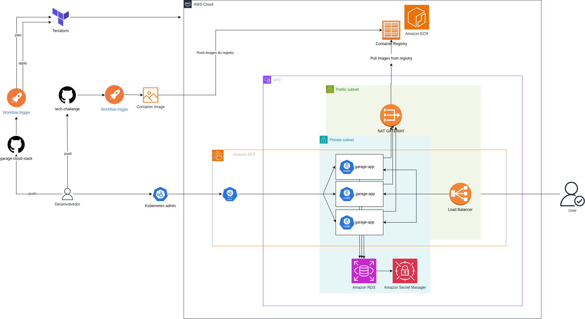

# SOAT Tech-challenge

## Sobre o Projeto

Sistema de gestão para oficinas mecânicas desenvolvido como projeto acadêmico da pós-graduação em Software Architecture da FIAP. A solução digitaliza e centraliza os processos operacionais de uma oficina, desde o atendimento inicial até a conclusão dos serviços, proporcionando maior controle e transparência na gestão.

## Problema que Resolve

Oficinas mecânicas frequentemente enfrentam desafios na gestão de ordens de serviço, controle de estoque de peças, acompanhamento de orçamentos e comunicação com clientes. Este sistema oferece uma plataforma integrada que:

- Centraliza informações de clientes e veículos
- Automatiza a criação e acompanhamento de ordens de serviço
- Facilita o controle de estoque de peças e materiais
- Gera orçamentos de forma ágil
- Permite que clientes acompanhem o status de seus serviços em tempo real

## Funcionalidades Principais

### Para Funcionários (Uso Interno)
- **Gestão de Clientes e Veículos**: Cadastro e manutenção de informações de clientes e seus veículos
- **Controle de Estoque**: Gerenciamento de peças e materiais disponíveis
- **Ordens de Serviço**: Criação, atualização e acompanhamento de OS
- **Geração de Orçamentos**: Criação de orçamentos detalhados para aprovação
- **Relatórios**: Visualização de relatórios de execução das ordens de serviço

### Para Clientes (Acesso Externo)
- **Acompanhamento de OS**: Consulta do status e andamento da ordem de serviço via endpoint público

## Perfis de Usuário

- **Administrativo**: Acesso completo ao sistema, gestão de usuários e configurações
- **Atendente**: Cadastro de clientes, veículos, criação de OS e orçamentos
- **Mecânico**: Atualização de status e execução das ordens de serviço
- **Cliente**: Consulta de status da própria ordem de serviço

## Arquitetura

O projeto implementa **Clean Architecture**, garantindo separação de responsabilidades, testabilidade e manutenibilidade do código. Atualmente desenvolvido como monolito, com estrutura preparada para evolução futura.

# Infraestrutura

A aplicação utiliza orquestração em Kubernetes, com escalonamento automático de pods por meio do **Horizontal Pod Autoscaler (HPA)**.
Toda a infraestrutura é gerenciada via **Infrastructure as Code (IaC)**, responsável pelo provisionamento do cluster Kubernetes na AWS.

## CI/CD

O projeto conta com uma pipeline de **CI/CD** configurada (GitHub Actions, GitLab CI, entre outras), responsável por:

- Build da aplicação
- Execução de testes automatizados
- Criação da imagem Docker
- Publicação da imagem no registry
- Deploy automatizado no cluster Kubernetes

Essa automação garante entregas contínuas, padronizadas e confiáveis em todos os ambientes.

## Diagrama de Arquitetura de Infraestrutura

## Tecnologias
- Java 21
- Maven
- Spring Boot
- PostgreSQL
- Docker
- Terraform (Infraestrutura AWS)
- Kubernetes (EKS)

## Documentação Adicional

- **[Arquitetura](docs/ARCHITECTURE.md)** - Regras arquiteturais e organização do código
- **[Guia de Execução](docs/SETUP.md)** - Instruções para executar o projeto
- **[Guia de Testes](docs/TESTING.md)** - Instruções para executar análises de cobertura e segurança
