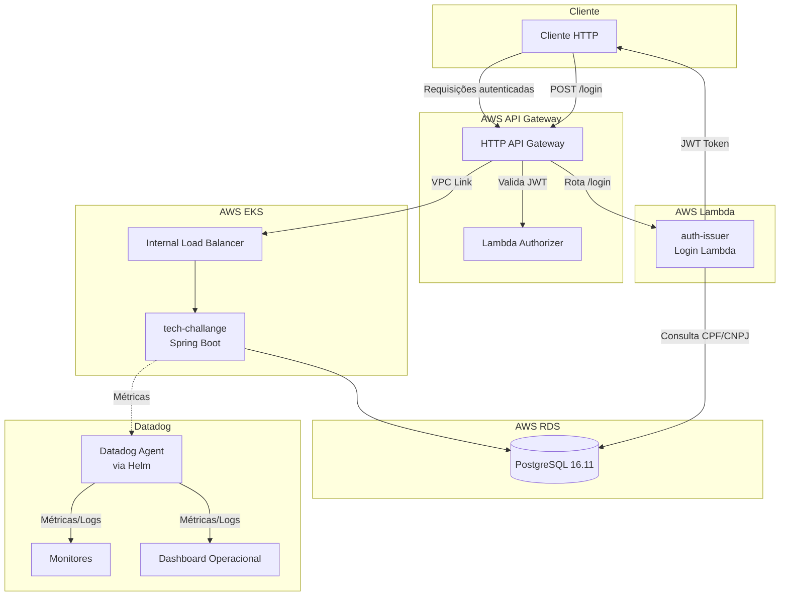

# Diagrama de Componentes — Projeto Garage

## Visão Geral

Este diagrama representa a arquitetura completa do sistema Garage, incluindo todos os componentes de infraestrutura AWS, a aplicação principal, o serviço de autenticação e a stack de observabilidade com Datadog.

O sistema segue uma arquitetura de microserviços na AWS, onde o API Gateway atua como ponto de entrada único, roteando requisições de autenticação para a Lambda `auth-issuer` e requisições autenticadas para a aplicação Spring Boot no EKS via VPC Link.

## Descrição dos Componentes

| Componente | Tecnologia | Descrição |
|---|---|---|
| **Cliente HTTP** | — | Consumidor externo da API (navegador, aplicação mobile, Postman) |
| **HTTP API Gateway** | AWS API Gateway v2 | Ponto de entrada único do sistema. Roteia requisições para a Lambda de login ou para o EKS via VPC Link |
| **Lambda Authorizer** | AWS Lambda | Valida tokens JWT nas requisições autenticadas antes de encaminhá-las ao backend |
| **auth-issuer (Login Lambda)** | AWS Lambda + Go | Serviço serverless de autenticação. Recebe CPF/CNPJ, consulta o banco de dados e emite um token JWT |
| **Internal Load Balancer** | AWS ALB (interno) | Balanceador de carga interno do cluster EKS, acessível via VPC Link do API Gateway |
| **tech-challange (Spring Boot)** | AWS EKS + Java 17 | Aplicação principal do sistema. Gerencia clientes, veículos, ordens de serviço, orçamentos e peças |
| **PostgreSQL 16.11** | AWS RDS | Banco de dados relacional que armazena todas as entidades do sistema (customers, vehicles, service_orders, etc.) |
| **Monitores** | Datadog | Monitores de alerta para latência P95, uso de CPU/memória, health check e taxa de erros |
| **Dashboard Operacional** | Datadog | Painel com métricas operacionais: volume de OS, latência, consumo de recursos e uptime |
| **Datadog Agent** | Datadog Agent via Helm | Agente instalado no cluster EKS que coleta métricas, logs e traces da aplicação |

## Fluxos Principais

### Fluxo de Autenticação
1. O cliente envia `POST /login` com CPF ou CNPJ para o API Gateway
2. O API Gateway roteia a requisição para a Lambda `auth-issuer`
3. A Lambda consulta o PostgreSQL para validar o documento
4. Se válido, a Lambda gera e retorna um token JWT ao cliente

### Fluxo de Requisições Autenticadas
1. O cliente envia uma requisição com o header `Authorization: Bearer <JWT>` para o API Gateway
2. O API Gateway invoca o Lambda Authorizer para validar o token JWT
3. Se autorizado, o API Gateway encaminha a requisição via VPC Link para o Load Balancer interno do EKS
4. O Load Balancer distribui a requisição para a aplicação Spring Boot
5. A aplicação processa a requisição e persiste/consulta dados no PostgreSQL

### Fluxo de Observabilidade
1. O Datadog Agent, instalado via Helm no cluster EKS, coleta métricas e logs da aplicação Spring Boot
2. As métricas são enviadas para os Monitores Datadog, que avaliam thresholds e disparam alertas
3. As métricas também alimentam o Dashboard Operacional para visualização em tempo real
