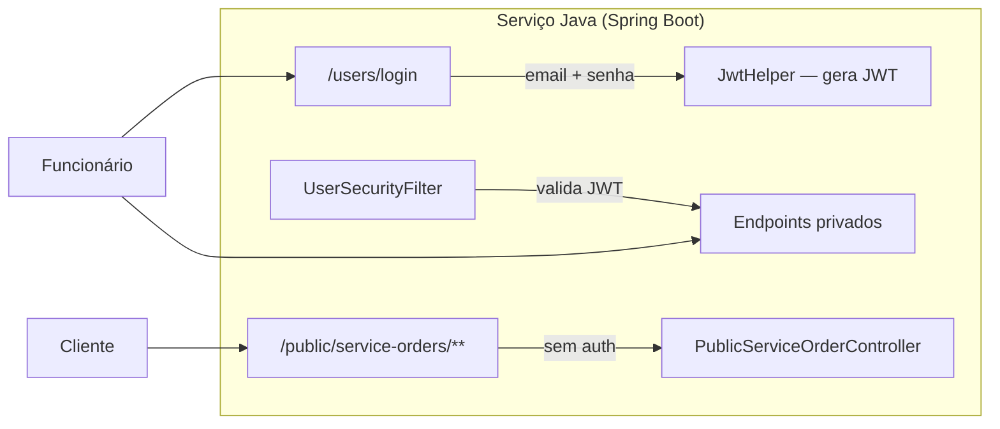
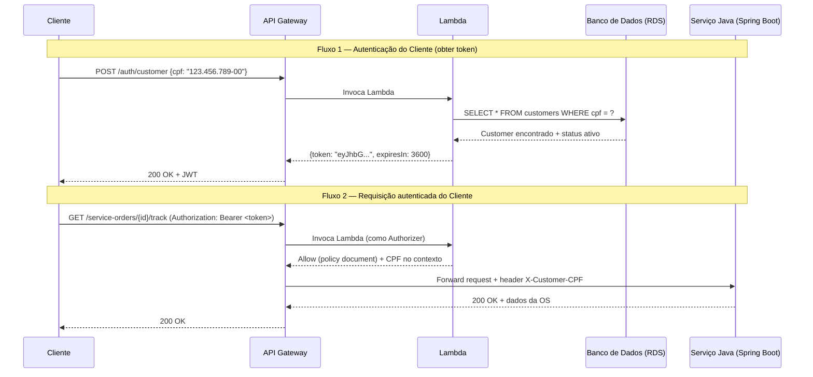
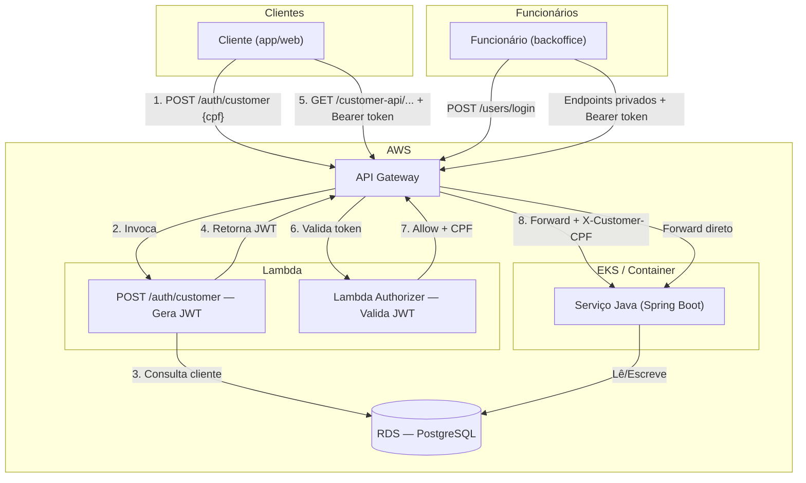

# RFC: Arquitetura de Autenticação de Clientes via API Gateway + Lambda

| Campo          | Valor                                      |
|----------------|---------------------------------------------|
| **Status**     | Proposta                                    |
| **Autor**      | Johann Bandelow                             |
| **Data**       | 2026-02-13                                  |
| **Componente** | API Gateway + Lambda Function (Autenticação)|

---

## 1. Situação Atual



| Tipo de Acesso | Autenticação Atual | Endpoints |
|---|---|---|
| **Funcionários (interno)** | JWT via `/users/login` (email + senha), validado pelo `UserSecurityFilter` | Todos os endpoints exceto `/public/**` |
| **Clientes (externo)** | **Nenhuma** — apenas validação de CPF no nível da OS | `/public/service-orders/{id}/track?cpfCnpj=...` |

---

## 2. Requisito

> Implementar API Gateway + Lambda Serverless para:
> 1. Validar CPF do cliente
> 2. Consultar existência e status do cliente na base de dados
> 3. Gerar e devolver um token JWT válido para consumo das APIs protegidas

---

## 3. Arquitetura Proposta



### 3.1 Componentes

#### AWS API Gateway

O API Gateway atua como **ponto de entrada único** para todas as requisições. Ele gerencia dois grupos de rotas:

| Grupo de Rotas | Authorizer | Destino |
|---|---|---|
| **Rotas de funcionários** (`/users/**`, `/customers/**`, `/quotes/**`, etc.) | Nenhum no API Gateway (o Spring Security já faz) | Serviço Java |
| **Rota de autenticação do cliente** (`POST /auth/customer`) | Nenhum (endpoint público) | Lambda |
| **Rotas protegidas do cliente** (`/customer-api/**`) | **Lambda Authorizer** | Serviço Java |

#### Lambda de Autenticação — Dupla Função

A Lambda de autenticação terá **duas responsabilidades**, acionadas de formas diferentes:

##### Função A: Emissão de Token (invocação direta)

```
POST /auth/customer
Body: { "cpf": "12345678900" }
```

1. Recebe o CPF do cliente
2. Consulta a tabela `customers` no banco de dados (RDS)
3. Valida se o cliente existe e está ativo
4. Se válido, gera um JWT contendo:
   - `sub`: CPF do cliente
   - `customer_id`: UUID do cliente
   - `type`: `"customer"` (diferenciador do token de funcionário)
   - `exp`: expiração (ex: 1 hora)
5. Retorna o token ao cliente

##### Função B: Authorizer do API Gateway

Quando configurada como **Lambda Authorizer** no API Gateway, ela:

1. Recebe o token JWT do header `Authorization`
2. Valida a assinatura e expiração
3. Extrai o CPF do `sub` do token
4. Retorna um **policy document** de Allow/Deny ao API Gateway
5. Injeta o CPF como contexto (`context.cpf`) — o API Gateway repassa via header `X-Customer-CPF`

#### Serviço Java — Adaptações Necessárias

O serviço Java precisa de **mudanças mínimas**:

- **Criar novos endpoints para clientes** (ex: `/customer-api/service-orders/{id}/track`) que leem o CPF do header `X-Customer-CPF` em vez de receber como query param
- **Não precisa validar o JWT do cliente** — isso já foi feito pela Lambda no API Gateway
- **Manter a autenticação interna existente** (`UserSecurityFilter` + `JwtHelper`) intacta para funcionários

> [!IMPORTANT]
> Os endpoints internos (funcionários) e externos (clientes) devem ser **completamente separados**. Não reutilize os mesmos endpoints para ambos os fluxos — isso evita confusão de permissões e simplifica a configuração do API Gateway.

---

## 4. Diagrama de Arquitetura Final



---

## 5. Segredo JWT

A Lambda e o serviço Java precisam usar a **mesma chave secreta** para assinar/validar os JWTs? **Não necessariamente**:

| Abordagem | Prós | Contras |
|---|---|---|
| **Chave separada** (recomendada) | Lambda é independente; Java não precisa validar token de cliente | Dois secrets para gerenciar |
| **Chave compartilhada** | Um único secret | Acoplamento; qualquer vazamento compromete ambos |

> [!TIP]
> **Recomendo chave separada**. O serviço Java **nunca precisa validar o JWT do cliente** — quem faz isso é a Lambda Authorizer. O Java só precisa confiar no header `X-Customer-CPF` que chega do API Gateway. Isso simplifica a integração e mantém o desacoplamento.

---

## 6. Resumo de Mudanças Necessárias

| Componente | O que fazer |
|---|---|
| **Lambda** (novo repo) | Criar função com handler duplo: emissão de JWT + authorizer |
| **API Gateway** (Terraform) | Configurar rotas, Lambda Authorizer, e integração com o serviço Java |
| **Serviço Java** | Criar endpoints `/customer-api/**` que leem `X-Customer-CPF` do header; permitir essas rotas sem `UserSecurityFilter` |
| **Terraform** | Criar recursos: Lambda, API Gateway, IAM roles, secrets |

---

## 7. Perguntas para Decisão

1. **A Lambda deve acessar o mesmo banco de dados (RDS) do serviço Java?** Isso é o mais simples, mas cria acoplamento. Alternativa: a Lambda poderia chamar um endpoint do serviço Java para validar o CPF.

2. **Os endpoints de funcionários também devem passar pelo API Gateway?** Sim, é recomendado para ter um ponto de entrada único com rate limiting, logging e monitoramento unificados.

3. **Qual será a expiração do token do cliente?** Sugestão: 1 hora (menor que o token de funcionário, que é 10 horas).
