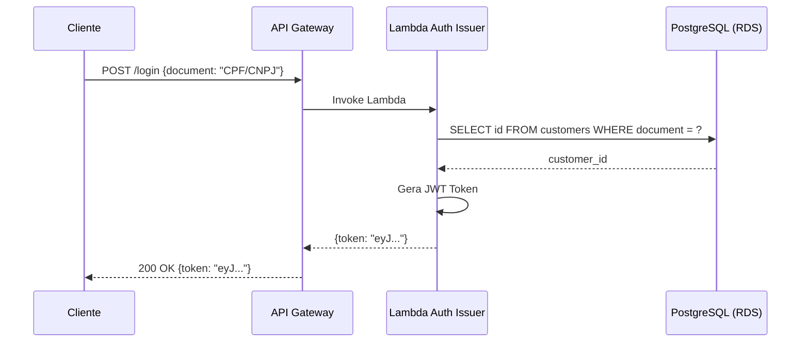

# Diagrama de Sequência — Fluxo de Autenticação

## Descrição

Este diagrama representa o fluxo completo de autenticação do sistema Garage. O processo inicia quando o cliente envia uma requisição `POST /login` com o documento de identificação (CPF ou CNPJ). A requisição é recebida pelo API Gateway, que invoca a Lambda `auth-issuer`. A Lambda consulta o banco de dados PostgreSQL (RDS) para validar o documento e, em caso de sucesso, gera um token JWT que é retornado ao cliente.

O token JWT obtido neste fluxo é utilizado nas requisições subsequentes para acessar os endpoints protegidos da aplicação, sendo validado pelo Lambda Authorizer configurado no API Gateway.

## Diagrama

## Detalhamento das Etapas

1. **Cliente → API Gateway**: O cliente envia uma requisição `POST /login` com o corpo `{ "document": "<CPF ou CNPJ>" }`. A rota `/login` no API Gateway está configurada sem autenticação (pública).
2. **API Gateway → Lambda Auth Issuer**: O API Gateway invoca a função Lambda `auth-issuer` passando o payload da requisição.
3. **Lambda Auth Issuer → PostgreSQL (RDS)**: A Lambda executa uma consulta SQL para buscar o cliente pelo documento informado na tabela `customers`.
4. **PostgreSQL (RDS) → Lambda Auth Issuer**: O banco retorna o `customer_id` correspondente ao documento, ou resultado vazio caso não exista.
5. **Lambda Auth Issuer (geração do JWT)**: Com o `customer_id` validado, a Lambda gera um token JWT contendo as informações do cliente.
6. **Lambda Auth Issuer → API Gateway**: A Lambda retorna o token JWT no corpo da resposta.
7. **API Gateway → Cliente**: O API Gateway repassa a resposta `200 OK` com o token JWT ao cliente.
