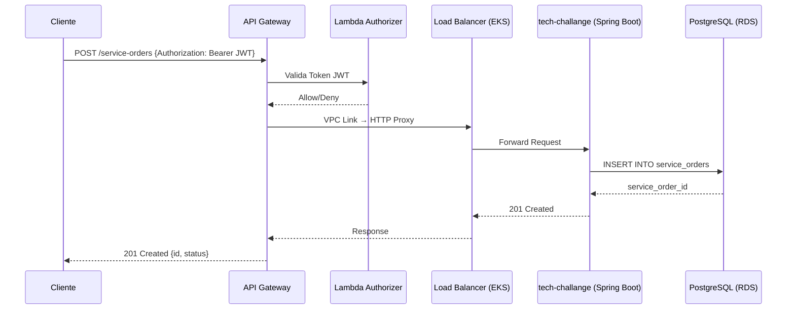

# Diagrama de Sequência — Abertura de Ordem de Serviço

## Descrição

Este diagrama representa o fluxo completo de abertura de uma Ordem de Serviço (OS) no sistema Garage. O processo inicia quando o cliente autenticado envia uma requisição `POST /service-orders` com o token JWT obtido no fluxo de autenticação. A requisição passa pelo API Gateway, que aciona o Lambda Authorizer para validar o token JWT. Após a autorização, a requisição é encaminhada via VPC Link ao Load Balancer interno do EKS, que direciona para a aplicação Spring Boot. A aplicação persiste a nova Ordem de Serviço no banco de dados PostgreSQL (RDS) e retorna a confirmação ao cliente.

## Diagrama

## Detalhamento das Etapas

1. **Cliente → API Gateway**: O cliente envia uma requisição `POST /service-orders` com o header `Authorization: Bearer <JWT>`. O token JWT foi obtido previamente no fluxo de autenticação (`POST /login`).
2. **API Gateway → Lambda Authorizer**: O API Gateway extrai o token JWT do header `Authorization` e invoca o Lambda Authorizer para validar a assinatura, expiração e claims do token.
3. **Lambda Authorizer → API Gateway**: O Lambda Authorizer retorna uma política de autorização (`Allow` ou `Deny`). Se o token for inválido ou expirado, o API Gateway retorna `401 Unauthorized` ao cliente e o fluxo é interrompido.
4. **API Gateway → Load Balancer (EKS)**: Com a autorização concedida, o API Gateway encaminha a requisição ao Load Balancer interno do EKS através do VPC Link, utilizando integração HTTP Proxy. O VPC Link garante comunicação privada dentro da VPC, sem exposição à internet pública.
5. **Load Balancer (EKS) → Aplicação Spring Boot**: O Load Balancer interno distribui a requisição para um dos pods da aplicação `tech-challange` rodando no cluster EKS.
6. **Aplicação Spring Boot → PostgreSQL (RDS)**: A aplicação valida os dados da requisição e executa um `INSERT INTO service_orders` no banco de dados PostgreSQL (RDS) para persistir a nova Ordem de Serviço.
7. **PostgreSQL (RDS) → Aplicação Spring Boot**: O banco de dados confirma a inserção e retorna o `service_order_id` gerado para o registro criado.
8. **Aplicação Spring Boot → Load Balancer (EKS)**: A aplicação retorna a resposta `201 Created` com os dados da Ordem de Serviço criada.
9. **Load Balancer (EKS) → API Gateway**: O Load Balancer repassa a resposta da aplicação ao API Gateway.
10. **API Gateway → Cliente**: O API Gateway retorna a resposta `201 Created` ao cliente, contendo o `id` e o `status` da Ordem de Serviço recém-criada.
